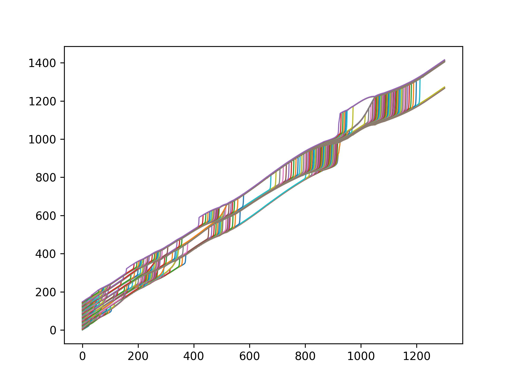

# Purpose

Wrap the righ-hand-side of the bunch1s models one by one with f2py.

# Usage

Download the latest build library built for your platform:

[Windows](https://nightly.link/vasilvas99/bunch1s_f2py/workflows/compile-bunch1s/main/build_windows.zip?h=5e973cebe0192e1902ec70ffb6946e18b78a24b2)

[Linux](https://nightly.link/vasilvas99/bunch1s_f2py/workflows/compile-bunch1s/main/build_unix.zip?h=5e973cebe0192e1902ec70ffb6946e18b78a24b2)

Then include it your python script with:

```python
import bunch1s
```

Currently provides the following equation right hand sides:

```shell
python3 -c "import bunch1s; print(bunch1s.__doc__);"
...
This module 'bunch1s' is auto-generated with f2py (version:1.24.0).
Functions:
    dy = gpmm2(y,m,bdef,p1,p2)
    dy = g1smm(y,m,bdef,p1,p2)
    dy = g1slw(y,m,par)
    dy = gkrug(y,m,par)
    dy = g_pk2(y,m,par)
    dy = g_mm0(y,m,par)
    dy = g_mm1(y,m,par)
    dy = gise2(y,m,par)
```

# Concept notes

We re-format the right-hand-sides to be compatible with the .f90 (Fortan-90) standart as it's more flexible with formatting
and automated formatters and linters (fprettify) exist that make the source code more readable and maintainable.

# Initial results

Integrating the wrapped g1smm with LSODA from SciPy for parameters:

```
bdef = 2.0
p1 = 3.0
p2 = 2.0
```

Yields nice looking trajectories and grouping:


